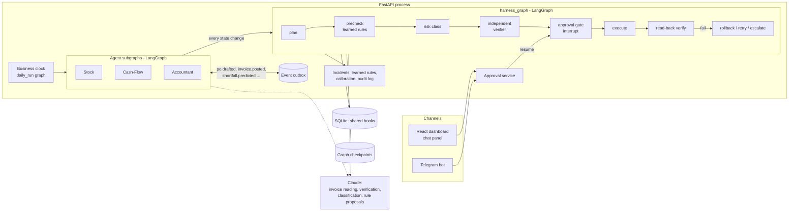

# Small Business Agent Suite

Three assistants for a small café or shop — **Stock**, **Cash-Flow** and **Accountant** — that share one set
of books, run every action through a common safety pipeline, and catch and learn from their own mistakes.
The owner works with them through a web dashboard (English or Arabic) and a Telegram bot.

- **Stock** forecasts demand from sales and recipes, warns before items run out and drafts purchase orders
  the owner approves in one tap; it checks deliveries and tracks waste and supplier performance.
- **Cash-Flow** projects cash for 30 days (and 13 weeks in three scenarios), warns weeks before a
  shortfall with a ranked plan, sets the weekly purchasing budget and sends payment reminders.
- **Accountant** reads supplier invoices (English, bilingual and Arabic, from photos or PDFs), checks and
  posts them with balanced entries, reconciles the bank, and prepares the VAT summary.

No assistant moves money or holds bank credentials: payments are recommended and scheduled, and the
owner pays. Country, currency, VAT and holidays come from a country profile (default Egypt, EGP).

## How it works



- **One pipeline for every action.** Each state-changing step is an `ActionSpec` run through
  `harness_graph`: plan → precondition checks (including owner-approved learned rules) → risk class →
  independent second check for high-impact outputs (orders, reminders, large journal entries, tax figures) →
  owner approval for anything irreversible or external → execute → read back and verify → roll back,
  retry once or escalate. Every stage is audited and streamed live to the Harness view.
- **Assistants talk through events.** Each agent writes only its own records; the others react to logged
  events (`po.drafted`, `invoice.held`, `shortfall.predicted`, …) handled in their own `handlers.py`.
  Conflicts (e.g. an order over budget) go to the owner with both positions; a critical stockout outranks
  the budget.
- **Self-correction.** Failed checks open incidents; each gets a root cause and a proposed rule the owner can
  approve, edit or reject. Accuracy is tracked per agent; an agent that slips switches to a safer method and
  asks more often until it recovers.
- **Chaos mode** injects 8 real faults (duplicate invoice, price spike, wrong date format, demand spike,
  early payment, missing bank day, short delivery, cash crunch) so the self-correction can be watched live.
- **Business clock.** A presenter can move the date forward; every skipped day runs the daily graph in order,
  so a demo covers weeks in minutes. The demo feed generates each day's sales and bank lines.
- **Claude** (via `app/llm/client.py`, structured outputs) reads invoices, reviews high-impact actions,
  classifies expenses, words owner messages and proposes rules. All maths and checks are deterministic code.
  Modes: `live`, `record`, `replay` (fixtures in `backend/tests/fixtures/llm/`) and `offline` (stand-ins).

## Repository

```
backend/    FastAPI + LangGraph app (app/agents, app/harness, app/graphs, app/api, app/chaos), Alembic, tests
frontend/   React + Vite dashboard (pages, components, i18n en/ar), Vitest and Playwright tests
specs/001-small-business-agents/   spec, plan, research, data model, API contracts, tasks, quickstart
```

## Setup

Requirements: Python 3.12, Node.js 20+, [`uv`](https://docs.astral.sh/uv/). An Anthropic API key is only
needed for live invoice reading or recording fixtures; a Telegram bot token is optional.

```powershell
cd backend;  uv sync;  uv run alembic upgrade head;  uv run python -m app.seed --sample-cafe
cd ../frontend;  npm install
```

`backend/.env` (optional): `DEMO_MODE=true`, `LLM_MODE=offline|replay|live|record`, `ANTHROPIC_API_KEY=…`,
`TELEGRAM_BOT_TOKEN=…`, `APP_ENV=dev|test|prod`.

## Run

```powershell
cd backend;  uv run uvicorn app.main:app --reload     # API, daily scheduler, Telegram polling
cd frontend; npm run dev                                # dashboard at http://localhost:5173
```

The seed prints the demo users (`owner`, `manager`, `staff`) and their passwords.

## Test

```powershell
cd backend;  uv run pytest                              # unit, contract, integration (LLM offline)
uv run pytest -m slow tests/integration/test_sample_metrics.py   # 3-month replay vs a no-assistant baseline
cd frontend; npm test; npx playwright test              # set PW_CHANNEL=chrome to use an installed Chrome
```

The full validation guide, including the manual demo walkthrough, is in
[specs/001-small-business-agents/quickstart.md](specs/001-small-business-agents/quickstart.md).
