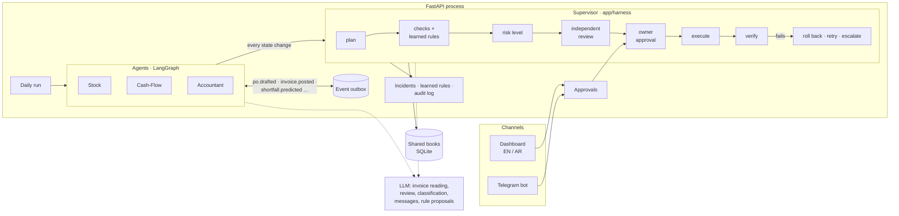

# Daftar · دفتر

**An AI back office for small businesses.** Three cooperating agents — **Stock**, **Cash-Flow** and
**Accountant** — keep a café's stock, cash and books right, inside a safety layer that checks every action
before it happens, asks the owner before anything costs money, verifies the result and learns from every
mistake.

*Daftar* is the Egyptian word for the ledger notebook every shop owner keeps. This one keeps itself.


---

## The problem

Owner-run businesses with 1–50 staff — cafés, restaurants, shops, clinics — lose money in three
predictable ways, and usually have no finance team to catch them:

| Where the money goes | What it looks like |
|---|---|
| **Stock** | Fast movers run out; slow movers are over-ordered and expire. |
| **Cash** | Rent, salaries and a big supplier payment land in the same week — and nobody saw it coming. |
| **Books** | Invoices arrive on paper, as PDFs and WhatsApp photos, often in Arabic, and are typed in late. Decisions are made on old numbers. |

## What Daftar does

| Agent | Job | Answers the owner's question |
|---|---|---|
| **Stock** | Forecasts demand from sales and recipes, warns before items run out, drafts purchase orders, checks deliveries, tracks waste and supplier reliability. | *"What do I need to order, and when?"* |
| **Cash-Flow** | Projects cash 30 days ahead (and 13 weeks in three scenarios), warns weeks before a shortfall with a ranked plan, sets the weekly purchasing budget, sends payment reminders only for invoices still unpaid. | *"Will I have enough cash, and what should I do now?"* |
| **Accountant** | Reads supplier invoices in English, Arabic or both, checks totals, VAT, dates and duplicates, matches order ↔ delivery ↔ invoice, posts balanced entries, reconciles the bank, prepares the VAT summary. | *"Are my numbers right, and what do I owe?"* |

The owner works with them through a web dashboard (English or Arabic, phone or desktop) and a Telegram bot.
Every request is answered with one tap or one short reply. **No agent moves money or holds bank credentials** —
payments are recommended and scheduled; the owner pays.

## Measured impact

A 91-day replay of the pilot business (a café in Egypt: 20 stock items, 5 suppliers) against a
*no-assistant* baseline that re-orders each item's 4-week average every Sunday — same demand, opening stock
and supplier lead times:

| Metric | Without Daftar | With Daftar |
|---|---|---|
| Stockout days | 152 | **3** (−98%) |
| Stock wasted | EGP 83,073 | **EGP 5,188** (−94%) |
| Stockouts warned ≥ 3 days ahead | — | **99%** (198 of 200) |
| Cash shortfalls flagged ≥ 14 days ahead | — | **4 of 4** (18–28 days early) |
| Bank lines matched automatically | — | **87%**, with 0 wrong matches |
| Owner time | — | **≈ 7 minutes a week** (≈ 9 one-tap answers) |

The replay is an automated test (`tests/integration/test_sample_metrics.py`) that writes its full report to
`backend/var/reports/sample_metrics.json`, so every number above can be re-run. The pilot data is realistic
but synthetic; owner time is modelled at 30 s per answer and 10 s per alert.

## How it works



- **One path for every action.** Each state-changing step runs through the same LangGraph pipeline:
  plan → precondition checks (including owner-approved learned rules) → risk level → an independent second
  review for high-impact outputs → owner approval for anything irreversible or external → execute → read back
  and verify → roll back, retry once or escalate. Every stage is audited and streamed live to the dashboard.
- **Agents cooperate through events.** Each agent writes only its own records; the others react to logged
  events. Conflicts (an urgent order that breaks the budget) go to the owner with both positions.
- **Self-correction.** A failed check opens an incident with its root cause and a proposed rule. Once the
  owner approves the rule, it is applied automatically from then on. Accuracy is tracked per agent; an agent
  that slips switches to a safer method and asks more often until it recovers.
- **Deterministic where it matters.** The model reads documents, reviews high-impact actions, classifies
  expenses, words messages and proposes rules. All arithmetic, matching and checks are plain code.

### See it catch mistakes: Chaos mode

The dashboard's **Chaos mode** injects eight real-world faults into the demo data — a duplicate invoice, a
supplier price spike, a wrong date format, a demand spike, a customer paying before a reminder, a missing bank
day, a short delivery, a cash crunch — and shows, on a live timeline, the agents detecting, explaining and
correcting each one and proposing a rule. A **business clock** moves the demo forward day by day, so weeks of
operation play out in minutes.

## Quick start

**Requirements:** Python 3.12, Node.js 20+, [uv](https://docs.astral.sh/uv/).

```bash
# Backend: install, create the database, load the sample café
cd backend
uv sync
uv run alembic upgrade head
uv run python -m app.seed --sample-cafe      # prints the demo users and their passwords
uv run uvicorn app.main:app --reload         # API on http://localhost:8000

# Dashboard (second terminal)
cd frontend
npm install
npm run dev                                  # http://localhost:5173
```

Sign in as `owner`. No API key is needed to try it: by default the model steps use deterministic offline
stand-ins. Then:

1. **Advance 1 day** in the header — the agents run their day; purchase orders and reminders arrive for approval.
2. **Harness** — the live pipeline of every action, incidents and learned rules.
3. **Chaos mode** — inject a fault and watch it get caught.
4. **Books → Try a sample invoice** — invoices in English, Arabic and both, including faulty ones.

## Configuration

Settings are read from environment variables or `backend/.env`.

| Variable | Default | Purpose |
|---|---|---|
| `LLM_MODE` | `offline` | `offline` (stand-ins, no API calls), `live`, `record` or `replay` (saved answers in `tests/fixtures/llm/`) |
| `ANTHROPIC_API_KEY` | — | Live calls to Claude through the Anthropic API (the default provider) |
| `LLM_PROVIDER` | `anthropic` | `openai_compatible` to use an OpenAI-style gateway instead … |
| `LLM_BASE_URL`, `LLM_API_KEY`, `LLM_MODEL` | — | … with its URL, key and model name |
| `TELEGRAM_BOT_TOKEN` | — | Owner approvals in Telegram (optional) |
| `DEMO_MODE` | `true` | Demo clock and Chaos mode |
| `APP_ENV` | `dev` | `dev`, `test` or `prod`; `prod` requires a private `SESSION_SECRET` |
| `DATABASE_URL` | SQLite in `backend/var/` | Database location |

## Tests

```bash
cd backend
uv run pytest                                               # unit, contract and integration tests (offline model)
uv run pytest -m slow tests/integration/test_sample_metrics.py   # the 91-day replay behind "Measured impact"

cd frontend
npm test                                                    # unit tests
npx playwright test                                         # end-to-end (PW_CHANNEL=chrome uses an installed Chrome)
```

## Project structure

```
backend/
  app/agents/       Stock, Cash-Flow and Accountant: graphs, actions and event handlers
  app/harness/      the supervisor: action pipeline, checks, verification, incidents, learned rules
  app/graphs/       the daily run that drives all three agents
  app/llm/          the single path to the model (live, record, replay, offline)
  app/api/          REST API and live event streams
  app/chaos/        fault injectors for Chaos mode
  app/seed/         the sample café
  alembic/          database migrations
  tests/            unit, contract and integration tests
frontend/
  src/pages/        Home, Stock, Cash, Books, Harness, Chaos mode, Settings
  src/components/   dashboard building blocks
  src/i18n/         English and Arabic
  tests/            unit (Vitest) and end-to-end (Playwright) tests
```

## Tech stack

**Backend:** Python 3.12, FastAPI, LangGraph, SQLAlchemy 2 (async) on SQLite, Alembic, Pydantic, statsmodels
(demand forecasting), ReportLab (PDF reports), python-telegram-bot.
**AI:** Claude through the Anthropic SDK with structured outputs, or any OpenAI-compatible gateway.
**Frontend:** React 19, TypeScript, Vite, TanStack Query, Tailwind CSS, Recharts, i18next.
